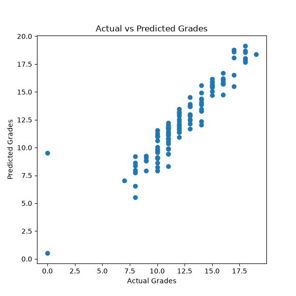
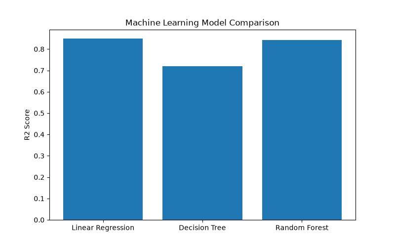

# student-grade-prediction-ml_Thiranex
Predictive modeling project using Python and Scikit-Learn to forecast student academic performance. Implemented Linear Regression, Decision Tree, and Random Forest models, evaluated using MAE, RMSE, and R² Score, and compared model performance through visualization.

machine-learning
python
scikit-learn
pandas
matplotlib
data-science
regression
predictive-modeling
student-performance
random-forest
decision-tree
linear-regression

## Visualizations Tab

### Actual vs Predicted

### Model_Comparison

